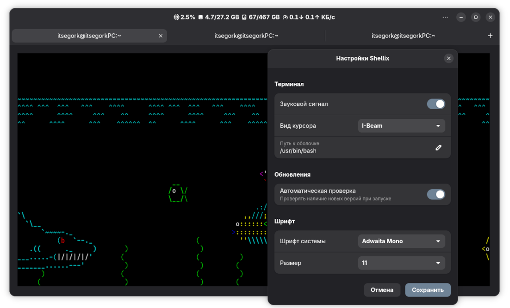

# SHELLIX

[](https://www.python.org/)
[](https://gtk.org/)
[](https://gnome.pages.gitlab.gnome.org/libadwaita/)

[](LICENSE)

**Virtual terminal for Linux** with modern GTK4/LibAdwaita interface.



## Features

- Modern GTK4/LibAdwaita design following GNOME guidelines
- Usage information: CPU, RAM, Disk, Connection
- Font settings

## Requirements

- Python 3.10+
- GTK4
- libadwaita
- python-requests
- PyGObject (python-gobject)
- Pango & Cairo
- VTE4
- psutil
- ttf-jetbrains-mono-nerd
- conspy

## Installation

### Arch Linux

```bash
sudo pacman -S python python-gobject python-requests gtk4 libadwaita pango cairo vte3 python-psutil ttf-jetbrains-mono-nerd
yay -S conspy 
git clone https://github.com/itsegork/shellix.git
cd shellix
makepkg -si
```

### Ubuntu/Debian

```bash
sudo apt install python3 python3-gi python3-requests python3-psutil libgtk-4-1 libadwaita-1-0 gir1.2-gtk-4.0 gir1.2-adw-1 libpango1.0-dev libcairo2-dev libvte-2.91-gtk4-dev fonts-jetbrains-mono conspy
git clone https://github.com/itsegork/shellix.git
cd shellix
python3 src/main.py
```

### Fedora
```bash
sudo dnf install python3 python3-gobject python3-requests python3-psutil gtk4 libadwaita pango cairo vte291-gtk4-devel jetbrains-mono-fonts-all conspy
git clone https://github.com/itsegork/shellix.git
cd shellix
python3 src/main.py
```

## License

This project is licensed under the **MIT License**.

### Third-Party Licenses

| Component | License | Copyright |
|-----------|---------|-----------|
| Material Icons | Apache 2.0 | Google LLC |
| requests | Apache 2.0 | Kenneth Reitz |
| GTK4, libadwaita, PyGObject, GLib, Gio, Gdk, VTE, Pango | LGPL 2.1+ | GNOME Project |
| psutil | BSD 3-Clause | Jay Loden, Dave Daeschler, Giampaolo Rodola |
| conspy | AGPL 3.0+ | Russell Stuart |

Full license texts are available in the [LICENSE](LICENSE) file.